<div align="center">
  <table>
    <thead>
      <tr>
        <th>
          
        </th>
        <th>
          <strong>UNIVERSIDAD LA SALLE DE AREQUIPA</strong><br />
          <strong>FACULTAD DE INGENIERÍAS Y ARQUITECTURA</strong><br />
          <strong>DEPARTAMENTO ACADÉMICO DE INGENIERÍA Y MATEMÁTICAS</strong><br />
          <strong>CARRERA PROFESIONAL DE INGENIERÍA DE SOFTWARE</strong>
        </th>
      </tr>
    </thead>
    <tbody>
      <tr>
        <td align="center">2026-I</td>
        <td align="center">Marco Antonio Camacho Alatrista</td>
        <td align="center">Ciberseguridad</td>
      </tr>
      <tr>
        <td colspan="2" align="center"><strong>Estudiante:</strong> Luis Enrique Patiño Herrera</td>
      </tr>
    </tbody>
  </table>
</div>

<div align="center">
  <h2><strong>PRUEBAS DE SOFTWARE — SELENIUM & JMETER</strong></h2>
  <p>Práctica final de pruebas automatizadas con Selenium WebDriver y Apache JMeter</p>
</div>

---

## Índice

- [Tecnologías utilizadas](#tecnologías-utilizadas)
- [Estructura del proyecto](#estructura-del-proyecto)
- [Parte 1: Pruebas con Selenium](#parte-1-pruebas-con-selenium)
  - [01 — Carga de página](#01--carga-de-página)
  - [02 — Campo de texto (Username)](#02--campo-de-texto-username)
  - [03 — Campo de contraseña (Password)](#03--campo-de-contraseña-password)
  - [04 — Área de texto (Textarea)](#04--área-de-texto-textarea)
  - [05 — Checkbox 1](#05--checkbox-1)
  - [06 — Checkbox 2](#06--checkbox-2)
  - [07 — Radio button masculino](#07--radio-button-masculino)
  - [08 — Radio button femenino](#08--radio-button-femenino)
  - [09 — Dropdown (select)](#09--dropdown-select)
  - [10 — Envío del formulario](#10--envío-del-formulario)
- [Parte 2: Pruebas con JMeter](#parte-2-pruebas-con-jmeter)
  - [01 — GET /Houses](#01--get-houses)
  - [02 — GET /Houses/{id}](#02--get-housesid)
  - [03 — GET /Wizards](#03--get-wizards)
  - [04 — GET /Wizards?firstName=Fred](#04--get-wizardsfirstnameFred)
  - [05 — GET /Spells](#05--get-spells)
  - [06 — GET /Spells/{id}](#06--get-spellsid)
  - [07 — GET /Elixirs](#07--get-elixirs)
  - [08 — GET /Elixirs/{id}](#08--get-elixirsid)
  - [09 — GET /Ingredients](#09--get-ingredients)
  - [10 — GET /Spells?name=Lumos](#10--get-spellsnamelumos)
- [Cómo ejecutar las pruebas](#cómo-ejecutar-las-pruebas)

---

## Tecnologías utilizadas

<div align="center">

[](https://nodejs.org/)
[](https://www.typescriptlang.org/)
[](https://www.selenium.dev/)
[](https://vitest.dev/)
[](https://jmeter.apache.org/)
[](https://git-scm.com/)
[](https://github.com/)

</div>

---

## Estructura del proyecto

```
pruebas-practica-final/
├── selenium/
│   ├── src/
│   │   ├── constantes/        # Tiempos y timeouts
│   │   └── test/              # 10 archivos de prueba (.test.ts)
│   ├── screenshots/           # 31 capturas generadas por los tests
│   └── package.json
├── jmeter/
│   ├── *.jmx                  # 10 planes de prueba JMeter
│   ├── capturas/              # 10 capturas de los reportes HTML
│   └── resultados/            # Reportes HTML generados por JMeter
└── README.md
```

---

## Parte 1: Pruebas con Selenium

Las pruebas Selenium automatizan un formulario HTML en [testpages.eviltester.com](https://testpages.eviltester.com/styled/basic-html-form-test.html) utilizando **Chrome WebDriver**. Se validan 10 escenarios distintos con **31 capturas de pantalla** en total.

> **Resultado:** 10/10 pruebas pasadas ✅

---

### 01 — Carga de página

Verifica que la página cargue correctamente: comprueba el título `"HTML Form Test Page | Test Pages"` y que la URL contenga `"form"`.

**Captura 1 — Página cargada**


**Captura 2 — Título verificado**

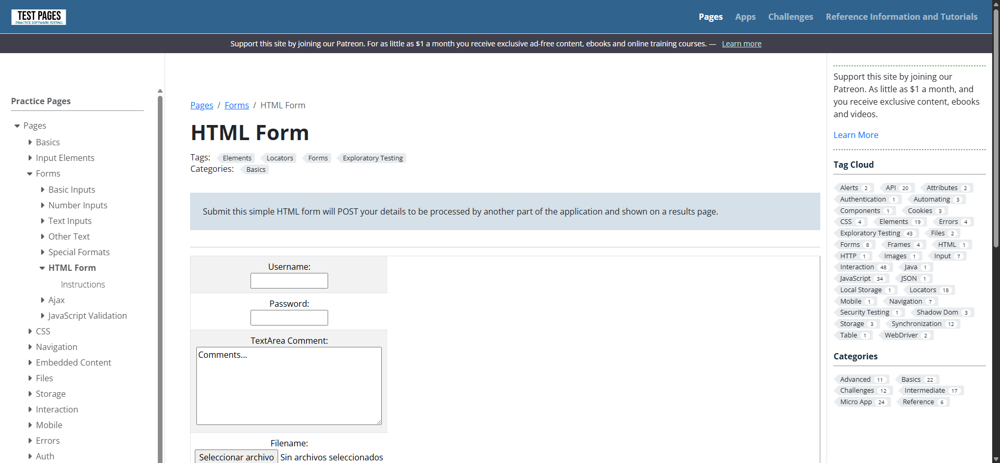

---

### 02 — Campo de texto (Username)

Limpia el campo `username`, escribe `"usuarioPrueba"` letra por letra y verifica que el valor ingresado sea correcto.

**Captura 1 — Campo enfocado (antes de escribir)**


**Captura 2 — Texto ingresado**


**Captura 3 — Valor limpiado y verificado**


---

### 03 — Campo de contraseña (Password)

Escribe `"contraseña123"` en el campo `password` y verifica que el campo esté habilitado. El texto aparece enmascarado como corresponde a un campo de tipo password.

**Captura 1 — Campo enfocado**

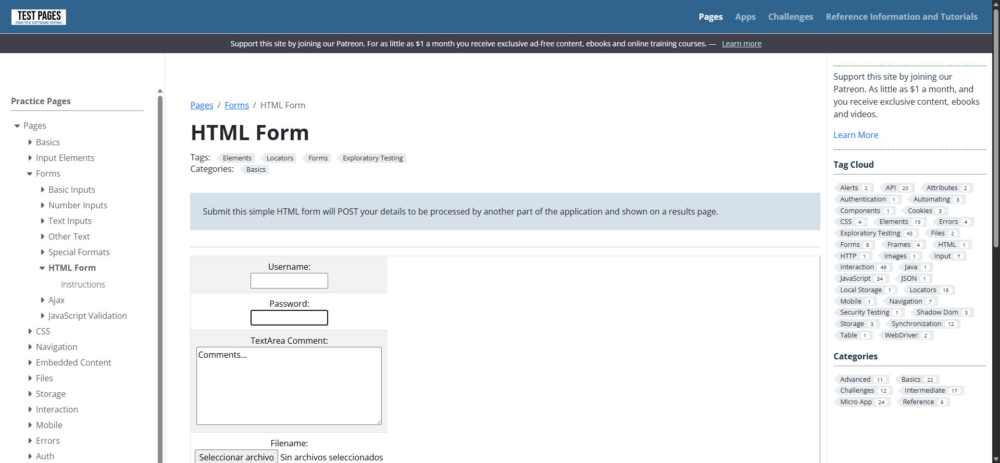

**Captura 2 — Contraseña ingresada (enmascarada)**

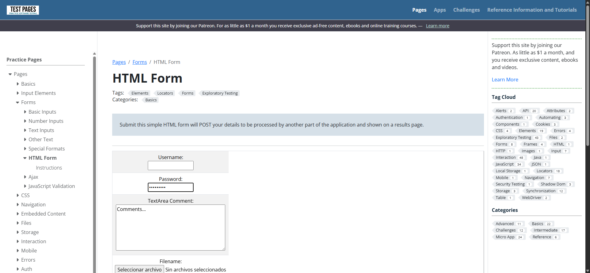

**Captura 3 — Campo verificado**


---

### 04 — Área de texto (Textarea)

Escribe una primera línea en el textarea, luego agrega una segunda línea usando `Key.RETURN`, y finalmente sobreescribe con un texto nuevo verificando que el valor actualizado sea correcto.

**Captura 1 — Textarea enfocado**


**Captura 2 — Texto multilinea ingresado**

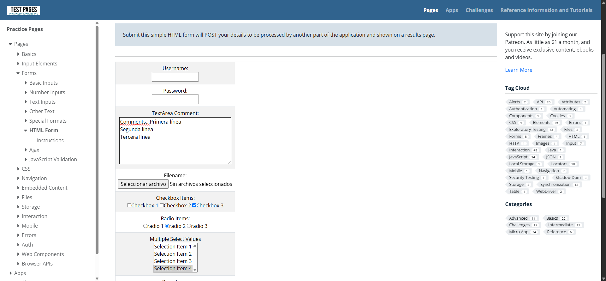

**Captura 3 — Texto reescrito y verificado**

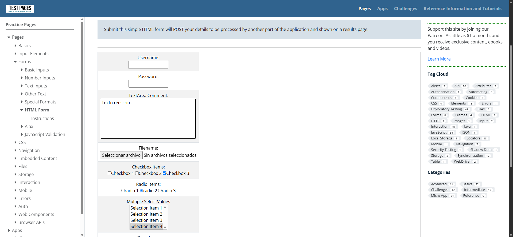

---

### 05 — Checkbox 1

Localiza el primer checkbox (`cb1`), verifica su estado inicial, hace clic para marcarlo y verifica que quedó marcado. Luego hace clic de nuevo para desmarcarlo y verifica el estado final.

**Captura 1 — Estado inicial del checkbox**


**Captura 2 — Primer clic (marcado)**

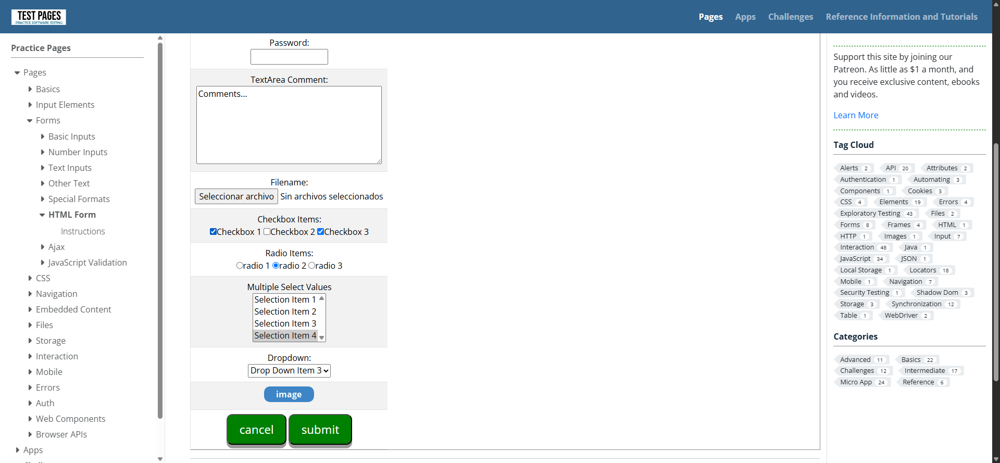

**Captura 3 — Segundo clic (desmarcado)**


---

### 06 — Checkbox 2

Igual que el test anterior pero con el segundo checkbox (`cb2`), confirmando que ambos funcionan de manera independiente.

**Captura 1 — Estado inicial**


**Captura 2 — Primer clic (marcado)**


**Captura 3 — Segundo clic (desmarcado)**


---

### 07 — Radio button masculino

Localiza el radio button `rd1`, verifica que no esté seleccionado inicialmente, hace clic y verifica que queda seleccionado.

**Captura 1 — Estado antes de seleccionar**


**Captura 2 — Radio seleccionado**


**Captura 3 — Estado verificado**


---

### 08 — Radio button femenino

Selecciona primero `rd1` (masculino) y luego `rd2` (femenino), verificando que al seleccionar uno el otro queda automáticamente deseleccionado (comportamiento de exclusión mutua).

**Captura 1 — Radio masculino activo**


**Captura 2 — Radio femenino seleccionado**

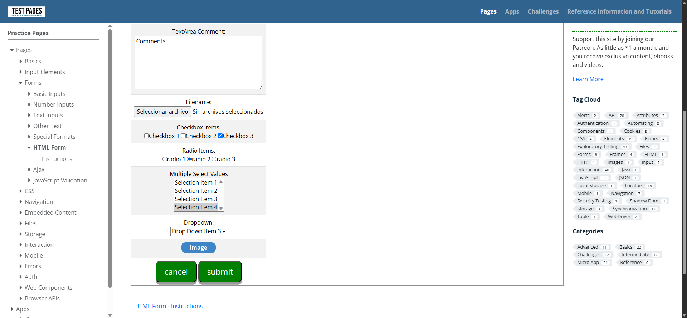

**Captura 3 — Exclusión mutua verificada**


---

### 09 — Dropdown (select)

Obtiene las opciones del dropdown `dropdown`, selecciona el índice 1 y verifica que el texto no esté vacío, luego selecciona el índice 2 y verifica que sea diferente al anterior.

**Captura 1 — Estado inicial del dropdown**

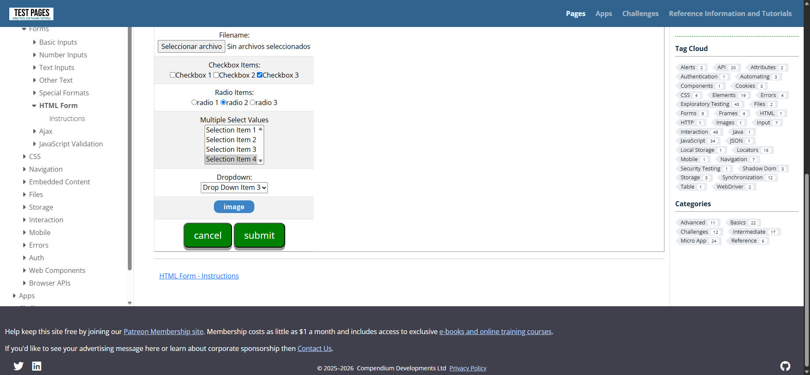

**Captura 2 — Opción 1 seleccionada**


**Captura 3 — Opción 2 seleccionada**


**Captura 4 — Verificación final**


---

### 10 — Envío del formulario

Llena el campo `username` con `"testEnvioFinal"`, hace scroll hasta el botón submit, lo hace clic y verifica que la URL cambia y que la página de resultado contiene el texto ingresado.

**Captura 1 — Formulario relleno**

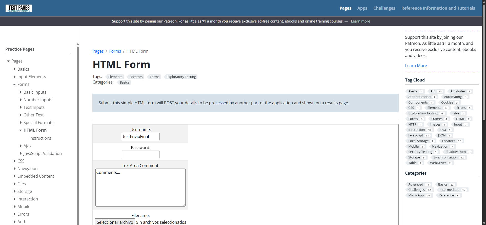

**Captura 2 — Botón submit visible**


**Captura 3 — Formulario enviado**


**Captura 4 — Resultados verificados**


---

## Parte 2: Pruebas con JMeter

Las pruebas JMeter realizan peticiones de carga a la API pública [wizard-world-api.herokuapp.com](https://wizard-world-api.herokuapp.com) con **5 usuarios simultáneos** por prueba. Cada test valida el código de respuesta HTTP 200 y la existencia del campo `id` en el JSON retornado.

> **Resultado:** 10/10 pruebas pasadas — PASS 100% en todas ✅

---

### 01 — GET /Houses

Lista todas las casas de Hogwarts. Verifica código 200 y que `$[0].id` exista en la respuesta.


---

### 02 — GET /Houses/{id}

Obtiene una casa específica por su UUID. Verifica código 200 y que `$.id` exista en la respuesta JSON.

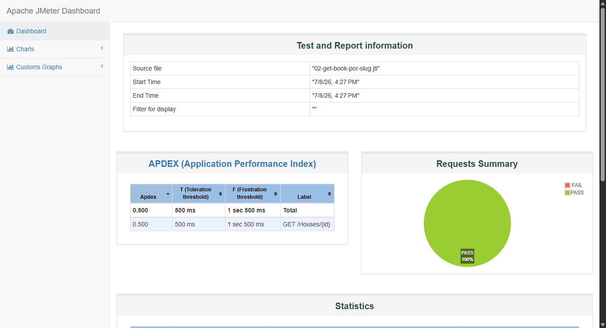

---

### 03 — GET /Wizards

Lista todos los magos registrados en la API. Verifica código 200 y la existencia de `$[0].id`.

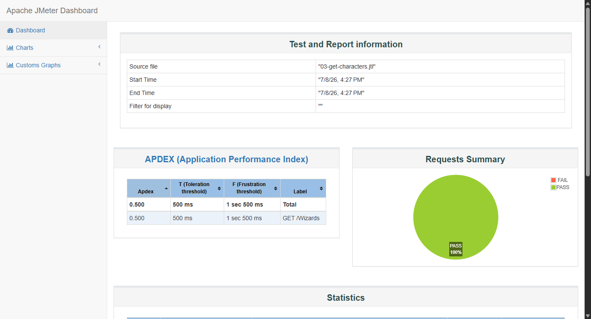

---

### 04 — GET /Wizards?firstName=Fred

Filtra magos por nombre de pila `Fred`. Verifica código 200 y que el primer resultado tenga campo `id`.


---

### 05 — GET /Spells

Lista todos los hechizos disponibles en la API. Verifica código 200 y la existencia de `$[0].id`.


---

### 06 — GET /Spells/{id}

Obtiene un hechizo específico por su UUID. Verifica código 200 y que `$.id` exista.


---

### 07 — GET /Elixirs

Lista todos los elixires registrados. Verifica código 200 y la existencia de `$[0].id`.

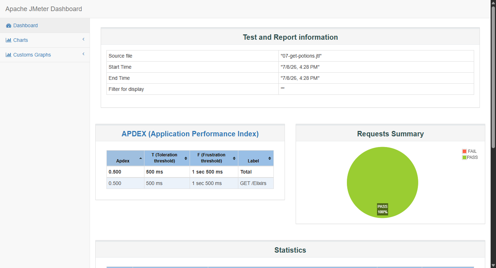

---

### 08 — GET /Elixirs/{id}

Obtiene un elixir específico por su UUID. Verifica código 200 y que `$.id` exista en la respuesta.


---

### 09 — GET /Ingredients

Lista todos los ingredientes disponibles en la API. Verifica código 200 y la existencia de `$[0].id`.


---

### 10 — GET /Spells?name=Lumos

Filtra hechizos por nombre `Lumos`. Verifica código 200 y que el primer resultado tenga campo `id`.

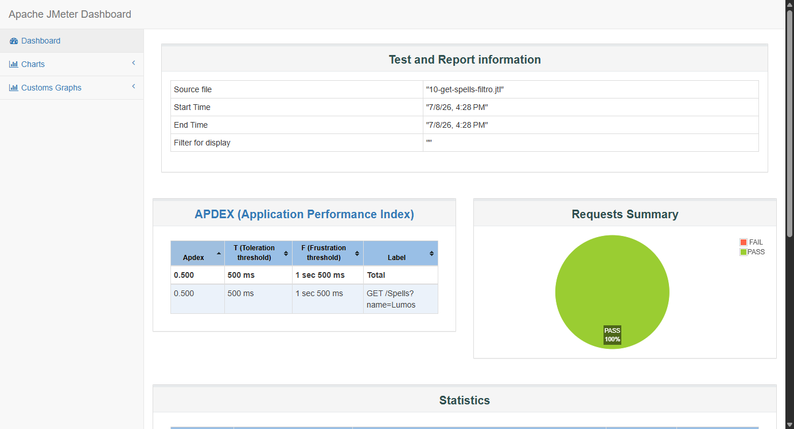

---

## Cómo ejecutar las pruebas

### Selenium

```bash
cd selenium
npm install
npm test
```

Las capturas se guardan automáticamente en `selenium/screenshots/`.

### JMeter

Requiere [Apache JMeter 5.6.3](https://jmeter.apache.org/download_jmeter.cgi) instalado.

```bash
# Ejemplo para ejecutar un plan de prueba individual
C:\Dev\apache-jmeter-5.6.3\bin\jmeter -n \
  -t jmeter/01-get-books.jmx \
  -l jmeter/resultados/01-get-books.jtl \
  -e -o jmeter/resultados/01-get-books-reporte
```

Los reportes HTML se generan en `jmeter/resultados/` y las capturas en `jmeter/capturas/`.
